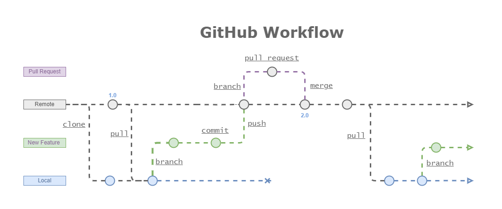

# Learning Git and Github

Version control is an essential skill for developers to master, and Git is by far the most popular version 
control system on the web. This presentation will show you how to use Git and apply the fundamental commands you 
need to work with Git projects: moving files, managing logs, and working with branches.

Version control is a system that records changes to a file or set of files over time so that you can recall specific
versions later. Git is a distributed version control system that enables you to store code, track revision history, 
merge code changes, and revert to an earlier code version when needed. It is a command-line tool that is installed 
locally in the system to manage source code versions.

GitHub is a Git repository hosting service delivered on a cloud-based platform. GitHub also serves as a social
networking site where developers store, share, and track code files and collaborate on software projects.

When working with Git, you typically get a Git repository in one of two ways:
1. You can take a local directory that is currently not under version control and turn it into a Git repository, or
2. You can clone an existing Git repository from elsewhere.

## The three main sections of a Git project


Git defines three main states that a project can reside in: *modified, staged, and committed.*
* Modified means that you have changed a file but have not committed it to your local database yet.
* Staged means that you have marked a modified file in its current version to go into your next commit snapshot.
* Committed means that the data is safely stored in your local database. 

From these states are derived the three main sections of a Git project: the working tree, the staging area, and the Git directory.

## The lifecycle of the status of your files


Git also specifies 4 possible stages for a file inside a project: *untracked, unmodified, modified, staged.*

If you intentionally want to not track a file, you should add a ".gitignore" file. In this special file we can intentionally
specifies untracked files that Git should ignore, like user-specific files generated by the IDE or sensitive information,
like passwords.

## GitHub Flow
A workflow is a set of tasks that help us accomplish a job in a consistent manner. Git define a workflow to help managing
project files and colaborate efectively during the software developemnt process. GitHub flow is a lightweight, 
branch-based Git workflow. A Git workflow is constructed from the following fundamental elements:
* Workspace (Working Directory)
* Staging (Index)
* Local Repository (Head)
* Remote Repository


*Git Workflow visualized with commands.*

### _GitHub Flow in seven steps_

The Git Feature Branch workflow is useful when you have more than one developer working on the same codebase.

Imagine there is one developer who is working on a new feature and another developer working on a second feature
in the same project. Now, if both developers work from the same branch and they both add commits, it would make 
the codebase a huge mess with plenty of conflicts.

To avoid this, the two developers can create two separate branches from the master branch and work on their features 
individually. When they're done with their feature, they can then merge their respective branch to the master branch 
and deploy without having to wait for the second feature to be completed.



### 1. Initial setup
If the remote repository is already created on GitHub, we need to clone it first in our local directory which 
creates a reference to the project on our computer.

That can be done by typing the following command in a terminal window:

```shell
git clone <repository URL>
```
If we are starting a new project from scratch we use the following command to create blank history:
```shell
git init
```
And, if it is a project we were previously working on, then we would just need to synchronize our local main branch 
with the remote before proceeding. 

To download and update the references from the remote repository we use:
```shell
git pull --rebase <repository name> <branch name>
```
Conventionally, the remote repository name is *origin*, and the default branch is *main*. e.g. `git pull --rebase origin main`

### 2. Create a new branch
To avoid making changes directly to the main branch we create a new branch using a meaningful name
and switch to work on it. The new features that we are adding to the project are all going to be changed in
there.

To create and switch to a new branch:
```shell
git branch <branch name>
```
```shell
git switch <branch name>
```
or simply in one command
```shell
git switch -c <branch name>
```

### 3. Make and Add the changes
If we want to see the status of the files that have modified on the current branch or that are waiting to be committed
we can run:
```shell
git status 
```
We make the desired changes inside the new branch. Then, when we are done with that feature, we add and commit those changes.

To add an specific modified file
```shell
git add <file path>
```
Also, to add all modified files to the staging area at the same time
```shell
git add --all
```
or
```shell
git add .
```

To save the changes we execute the following command including a comment that summarizes the changes we have
made.
```shell
git commit -m "A descriptive message"
```

### 4. Merge with a pull request
When we have finished the changes in the feature branch, after we make sure it is working well in our local
repository, we have to merge those new changes to the main branch. For doing that, push the feature branch 
to the remote repository.

```shell
git push <repository name> <branch name>
```
Then, on the remote server, we first create a pull request from the feature branch pushed. This process helps to control and review the new changes we are adding to the main branch.

After the pull request is reviewed and approved (if necessary), the changes are merged/rebased/squashed to main in the remote repository.

### 5. Delete the feature branch
Finally, after all changes are applied, we delete the branch we don't need anymore. 

First we switch back to main:
```shell
git switch main
```
And then delete the feature branch
```shell
git branch --delete <branch name>
```

> **IMPORTANT** ⚠️ If any conflict emerges in any of the previous steps, we must locate the source of the conflict and solve it. The remote repository represents the ultimate source of truth , so its commit history should be treated as sacred and immutable. If one of our local commits diverges from the main branch, we should not push those changes because this would overwrite official commits. We first solve the conflict and later continue with the merge.

### 6. Start over again
After we finish the previous series of changes, we can start all over again from step 1 with a new feature. 

To see commits history we can type the commands:
```shell
git log
```
or
```shell
git log --oneline
```
We can see all our branches in our local repository with:
```shell
git branch 
```
Or list all local and remote branches:
```shell
git branch -a
```
### Advantages of the GitHub Flow
The pros of using this workflow are that it allows you to collaborate on a shared code base and minimize code conflicts.

* **Flexible and lightweight** – GitHub Flow is a lightweight and flexible workflow that helps developers collaborate on software development projects. It allows for quick iteration and tryouts with minimal complexity.

* **Simplified collaboration** – GitHub Flow provides a clear and streamlined process for managing feature development. It encourages small, focused changes that can be quickly reviewed and merged, improving efficiency.

* **Clear version control** – With GitHub Flow, every change is made in a separate branch. This establishes a clear and traceable version control history. This helps developers track and understand changes, revert if necessary, and maintain a reliable code base.

* **Seamless continuous integration** – The creation of pull requests can initiate automated testing and deployment processes. Continuous Integration tools help you thoroughly test changes before they are merged into the main branch, reducing the risk of introducing bugs into the code base.

* **Rapid feedback and continuous improvement** – By promoting frequent code reviews and discussions through pull requests, it facilitates early detection of issues, promotes knowledge sharing among team members, and ultimately leads to higher code quality and better collaboration within the development team.

* **Simplified rollbacks** –  By having a clear history of commits and branches, it is easier to identify and revert problematic changes, helping to maintain a stable and functional code base.

* **Lightweight learning curve** – Its simplicity and intuitive branching model make it accessible for developers of varying experience levels, reducing the learning curve associated with adopting new development workflows.

* **Continuous development** – GitHub Flow empowers teams to embrace a continuous deployment approach by enabling the immediate deployment of every change as soon as it is merged into the main branch.

## Git Commands
This is a comprehensive list of he most commonly used Git commands.

### _Setup and Config_

### git
Root command that does the content tracking

Prints the Git suite version that the git program came from
```shell
git --version
```

Prints the synopsis and a list of the most commonly used commands
```shell
git --help
```

### config
Get and set repository or global options
```shell
git config --global
```

Set the global variable *name*. The name is used to identify the author when tracking changes in a repository.
```shell
git config --global user.name "<Your Name>"
```

Set the *email* global variable. It should be the same email we used to create our GitHub account. This way our local repository will set our authentication credentials when we try to push changes to the remote repository.
```shell
git config --global user.email "<your email>"
```

Replace the unix-style LF with windows-style *CRLF* after commit-checkout cycle
```shell
git config --system core.autocrlf false
```

### _Getting and Creating Projects_

### init
Create an empty Git repository or reinitialize an existing one
```shell
git init
```

### clone
Copy a *remote* repository into a *local* directory
```shell
git clone <repository URL>
```

### _Basic Snapshotting_

### add
Add file contents to the *index* (Staging)
```shell
git add <directory path>
```
or
```shell
git add <file name>
```

Add all files content to the *index*
```shell
git add --all
```
or
```shell
git add .
```

### status
Show the *working tree* status, branch name, untracked and modified files
```shell
git status 
```

### commit
Record *changes* (staged) to the repository
```shell
git commit -m "A descriptive message"
```
Save current changes to the last commit
```shell
git commit --amend
```
Save current changes to the last commit using same comment
```shell
git commit --amend --no-edit
```
Save the last commit using a new comment
```shell
git commit --amend -m "New commit message"
```

### log
Show commit logs
```shell
git log
```
Git log summarized
```shell
git log --oneline
```

### restore
Restore a file in the *working tree* to the last committed version
```shell
git restore <file name>
```
Restore current directory to the last commit in HEAD
```shell
git restore .
```
Restore file from *staging* area to the state of the last commit
```shell
git restore --staged <file name>
```

### reset
Reset current *HEAD* to the specified state
```shell
git reset <commit hash>
```

Undo the *commit(s)* but preserves the changes in *modified* state
```shell
git reset HEAD~<Commit index number>
```

Destroy the commit(s) and also throw away any uncommitted changes
```shell
git reset --hard HEAD~<Commit index number>
```

### rm
Remove files from the *working tree* and from the *index*
```shell
git rm <file name>
```

Remove files from just the *staging area* but not from the working directory (i.e. untracked)
```shell
git rm --cached <file name>
```

### mv
Move or rename a file, a directory, or a symlink
```shell
git mv <file name> <new file name>
```

### _Branching and Merging_

### branch
List branches
```shell
git branch 
```
Create branch
```shell
git branch <branch name>
```
To rename the current branch
```shell
git branch -m <new name>
```
To rename any other branch
```shell
git branch -m <old name> <new name>
```
Connect a *local* branch to a branch in a *remote* repository
```shell
git branch --set-upstream-to <repository name> <branch name>
```
```shell
git branch -u <repository name> <branch name>
```
List *all* local and remote branches
```shell
git branch --all
```
Delete branch
```shell
git branch --delete <branch name>
```

### switch
Switch branches
```shell
git switch <branch name>
```
Create and switch to new branch
```shell
git switch -c <branch name>
```

### merge
Join two or more development histories together
```shell
git merge <branch name>
```

### checkout
Switch branches or restore working tree files
```shell
git checkout <branch name>
```

### stash
Stash away the changes in a dirty working directory 
```shell
git stash
```
Show changes has been stashed
```shell
git stash list
```
Apply specified changes to working directory
```shell
git stash apply <list index number>
```
Delete the last element in the stash list and brings it to the *working directory*
```shell
git stash pop
```

### _Sharing and Updating Projects_

### remote
*Connect* a local repository to a remote repository
```shell
git remote add <alias name> <repository URL>
```
Remove a reference to remote repository
```shell
git remote remove <repository name>
```
Rename a remote repository
```shell
git remote rename <repository name> <new name>
```
List all tracked remote repositories
```shell
git remote --verbose
```
```shell
git remote -v
```

### fetch
Synchronized *objects* and *refs* from remote repository to local
```shell
git fetch
```

### pull
Fetch from remote repository and merge with local branch
```shell
git pull
```
```shell
git pull <repository name> <branch name>
```
Update local branch with remote repository 
```shell
git pull --rebase <repository name> <branch name>
```

### push
Update remote refs along with associated objects
```shell
git push --set-upstream-to <repository name> <branch name>
```
```shell
git push -u <repository name> <branch name>
```
Send files from local directory to cloud repository
```shell
git push <repository name> <branch name>
```
Move all local branches to remote
```shell
git push --all
```

### _Versioning with Tags_

### tag 
Create a simple tag to reference a point in history
```shell
git tag <tag name>
```

Create a new tag annotated with a description
```shell
git tag -a <tag name> -m "A descriptive coment"
```

Share a tag explicitly with a remote repository
```shell
git push <repository name> <tag name>
```

### _Using Projects as Submodules_

### submodule 
Add other project as submodule
```shell
git submodule add <repository URL> <directory path>
```
Cloning a Project with Submodules in three steps:
1. clone
```shell
git clone <repository URL>
```
2. init submodules
```shell
git submodule init
```
3. update submodules
```shell
git submodule update
```
or, step 2 and 3
```shell
git submodule update --init --recursive
```
These three steps can be simplified as follows:
```shell
git clone --recurse-submodules <repository URL>
```
Adding a Submodule with a specific *tag* (version):
1. Add the submodule
```shell
git submodule add <repository URL> <directory path>
```
2. Navigate to the submodule directory:
```shell
cd <directory path>
```
3. Inside the directory, checkout the desired tag
```shell
git checkout tags/<tag name>
```
4. Go back to the project *root directory* and commit the changes:
```shell
cd ..
```
```shell
git add <directory path>
```
```shell
git commit -m "Checked out tag tag-name for submodule"
```
Switching an existing Submodule to another tag:
1. Navigate to the submodule directory:
```shell
cd <directory path>
```
2. Download all tags and branches
```shell
git fetch --all --tags
```
3. Checkout the desired tag
```shell
git checkout tags/<tag name>
```
4. Return to the root directory and commit the changes:
```shell
cd ..
```
```shell
git add <directory path>
```
```shell
git commit -m "Switched submodule to tag tag-name"
```

### _Inspection and Comparison_

### show
Shows the log message and textual diff.
```shell
git show <commit hash>
```

### diff
Show changes between commits, commit and working tree
```shell
git diff <commit hash>
```

### describe
finds the most recent tag that is reachable from a commit and show its name
```shell
git describe
```

### _Patching_

### rebase
Reapply commits on top of another base tip
```shell
git rebase --interactive <Commit Hash>
```
```shell
git rebase --interactive <Branch Name>
```
Change a commit from the past
```shell
git rebase --interactive HEAD~<Commit index number>
```

### apply
Apply a patch to files or to the index
```shell
git apply
```

### cherry-pick
Apply the changes introduced by some existing commits
```shell
git cherry-pick
```

### revert
Create a *new commit* which revert the changes made in a given commit
```shell
git revert <commit hash>
```
