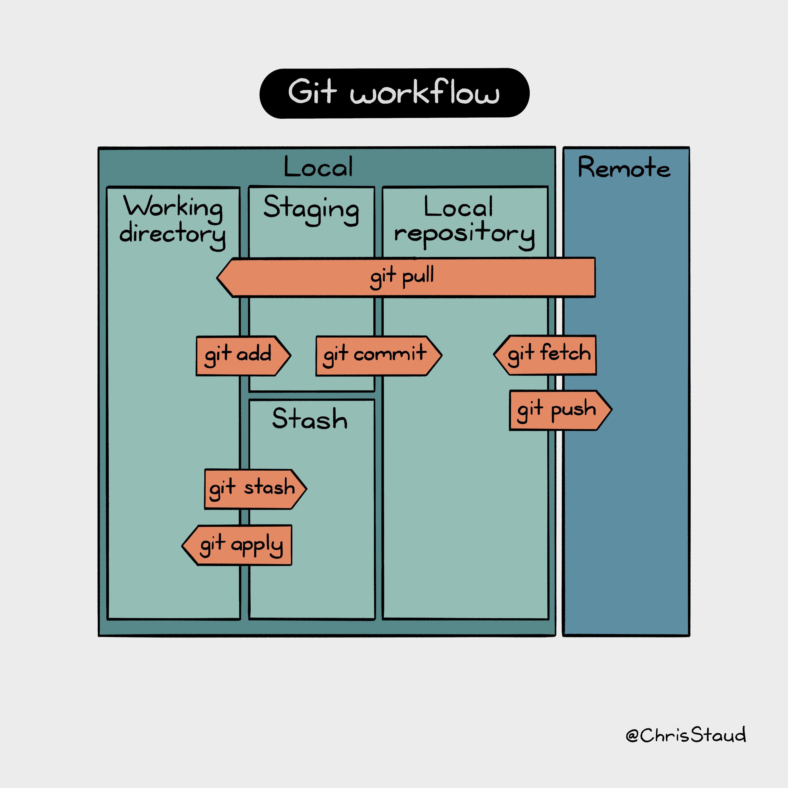

# Learning Git and Github

Version control is an essential skill for developers to master, and Git is by far the most popular version control system on the web. In this fast-paced course, author Ray Villalobos shows you how to install Git and use the fundamental commands you need to work with Git projects: moving files, managing logs, and working with branches.

Plus, you'll learn how to work with the popular GitHub website to explore existing projects, clone them to your local hard drive, and use them as templates for your new projects.

Version control is a system that records changes to a file or set of files over time so that you can recall specific 
versions later. Git is an open-source version control system that enables you to store code, track revision history, 
merge code changes, and revert to earlier code version when needed. It is command line tool that it is installed 
in locally in the system to manage source code version.

GitHub is Git repository hosting service delivered in a cloud based platform. GitHub also serves as a social 
networking site where developers, store, share and track code files and collaborate on software projects.

Whe working with Git you typically get a Git repository in one of two ways:
1. You can take a local directory that is currently not under version control, and turn it into a Git repository, or
2. You can clone an existing Git repository from elsewhere.

Git has three main states that your files can reside in: modified, staged, and committed
* Modified means that you have changed the file but have not committed it to your database yet.
* Staged means that you have marked a modified file in its current version to go into your next commit snapshot.
* Committed means that the data is safely stored in your local database. 

This leads us to the three main sections of a Git project: the working tree, the staging area, and the Git directory.

## The three main sections of a Git project


## The lifecycle of the status of your files


If you want to intentionally to not track a file you should add a ".gitignore" file. It specifies intentionally 
untracked files that Git should ignore. Like user specific files generated by the IDE or sensitive information, 
like passwords.

## Git Commands

## _Setup and Config_

### git
Root command doing the content tracking

Prints the Git suite version that the git program came from
```shell
git --version
```

Prints the synopsis and a list of the most commonly used commands
```shell
git --help
```

### config
Get and set repository or global options
```shell
git config --global
```
```shell
git config --global user.name "<Your Name>"
```
```shell
git config --global user.email "<your email>"
```
## _Getting and Creating Projects_

### init
Create an empty Git repository or reinitialize an existing one
```shell
git init
```

### clone
Copy a remote repository into a local directory
```shell
git clone <repository URL>
```

## _Basic Snapshotting_

### add
Add file contents to the index (Staging)
```shell
git add <file name>
```
Add all files contents to the index
```shell
git add --all
```
```shell
git add .
```

### status
Show the working tree status
```shell
git status 
```

### commit
Record changes to the repository
```shell
git commit -m "A descriptive message"
```
Add current changes to the last commit
```shell
git commit --amend
```
Add current changes to the last commit using same comment
```shell
git commit --amend --no-edit
```
Add current changes to the last commit with a new comment
```shell
git commit -amend -m "New commit message"
```

### log
Show commit logs
```shell
git log
```
Git log summarized
```shell
git log --oneline
```

### restore
Restore working tree files
```shell
git restore <file name>
```
Restore current directory
```shell
git restore .
```
Restore file from staging area
```shell
git restore --staged <file name>
```

### reset
Reset current HEAD to the specified state
```shell
git reset <commit hash>
```

### rm
Remove files from the working tree and from the index
```shell
git rm  <file name>
```

### mv
Move or rename a file, a directory, or a symlink
```shell
git mv  <file name> <new file name>
```

## _Branching and Merging_

### branch
List branches
```shell
git branch 
```
Create branch
```shell
git branch <branch name>
```
Connect a local branch to a branch in a remote repository
```shell
git branch --set-upstream-to <repository name> <branch name>
```
```shell
git branch -u <repository name> <branch name>
```
List all local and remote branches
```shell
git branch --all
```
Delete branch
```shell
git branch --delete <branch name>
```

### switch
Switch branches
```shell
git switch <branch name>
```
Create and switch to new branch
```shell
git switch -c <branch name>
```

### merge
Join two or more development histories together
```shell
git merge <branch name>
```

### checkout
Switch branches or restore working tree files
```shell
git checkout <branch name>
```

### stash
Stash the changes in a dirty working directory away
```shell
git stash
```
Show changes has been stashed
```shell
git stash list
```
Apply specified changes to working directory
```shell
git stash apply <list index number>
```
Delete the last element in the stash list and brings it to the working directory
```shell
git stash pop
```

## _Sharing and Updating Projects_

### remote
Connect a local repository to a remote repository
```shell
git remote add <alias name> <repository URL>
```
Remove a reference to remote repository
```shell
git remote remove <name>
```
Rename a remote repository
```shell
git remote rename <name> <new name>
```
List all tracked remote repositories
```shell
git remote --verbose
```
```shell
git remote -v
```

### fetch
Synchronized objects and refs from remote repository to local
```shell
git fetch
```

### pull
Fetch from and merge with remote repository and local branch
```shell
git pull
```

### push
Update remote refs along with associated objects
```shell
git push --set-upstream-to <repository name> <branch name>
```
```shell
git push -u <repository name> <branch name>
```
Send files from local directory to cloud repository
```shell
git push <repository name> <branch name>
```
Move all local branches to remote
```shell
git push --all
```

## _Inspection and Comparison_

### show
```shell
git show
```

### diff
```shell
git diff
```

### describe
```shell
git describe
```

## _Patching_

### rebase
Reapply commits on top of another base tip
```shell
git rebase --interactive <Commit Hash>
```
```shell
git rebase --interactive <Branch Name>
```

### apply
```shell
git apply
```

### cherry-pick
```shell
git cherry-pick
```

### revert
```shell
git revert
```

## Git Workflow
These are the four fundamental elements that composed the Git workflow:
* Workspace (Working Directory)
* Staging (Index)
* Local Repository (Head)
* Remote Repository


Git Workflow with commands.

## Git Feature Branch Workflow

The Git Feature Branch workflow is useful when you have more than one developer working on the same codebase.

Imagine you have one developer who is working on a new feature. And another developer working on a second feature. 
Now, if both the developers work from the same branch and add commits to them, it would make the codebase a huge 
mess with plenty of conflicts.

To avoid this, the two developers can create two separate branches from the master branch and work on their features 
individually. When they’re done with their feature, they can then merge their respective branch to the master branch, 
and deploy without having to wait for the second feature to be completed.

The Pros of using this workflow is, the git feature branch workflow allows you to collaborate on code and minimize 
code conflicts.


## How it is going to work
The Simplified Git Flow with GitHub

## 1. Initialize the local repository
Once a centralized remote repository is created on GitHub, we have to clone it on our local directory to
create a reference to the project in our local computer.

That can be done with "Open a project from remote repository" option in Eclipse or typing the following
command in a window terminal:

```shell
git clone <repository URL>
```

## 2. Set global configuration
After done that, with the terminal open rooted to project local directory, we set the global configuration
variables, name and email. The same email we used to create our GitHub account. This way our local repository
will set our authentication credentials when we try to push changes to the remote repository.

```shell
git config --global user.name "<Your Name>"
```
```shell
git config --global user.email "<your email>"
```

## 3. Set up the Working directory
We rename our local master branch to "main".
```shell
git branch -M main
```

## 4. Make changes and commit
To avoid making changes directly to the main branch we have to create a new branch with a meaningful name
and switch to work on it. The new features that we are going to be adding to the project are all changed
there. Then, when finnish that feature, we commit to save them.

To create and switch to a new branch:
```shell
git branch <branch name>
```
```shell
git switch <branch name>
```
or simply in one command
```shell
git switch -c <branch name>
```

So, here is where you star working with your part of the project. After you finish with all your files, then you add
and commit those changes.

To add all modified files to the staging area.

```shell
git add --all
```
or
```shell
git add .
```

If we want to see the status of the files that have been modified on the current branch or waiting to be committed
we can run.
```shell
git status 
```

To save the changes we execute the following command including a comment that summarize the changes been
made.
```shell
git commit -m "A descriptive message"
```

## 5. Merge the feature branch
After we finnish making changes on the feature branch and tested the new changes are working well in our local
machine, we have to merge those new changes to the main branch. For that, we switch to the main branch first:
```shell
git switch main
```
And on the main branch we merge the feature branch back to main:
```shell
git merge <branch name>
```
Finally, we delete the branch we don't need anymore:
```shell
git branch --delete <branch name>
```

## 6. Push new commits to remote repository
We all our changes saved on our local version of the main branch, now we would need to synchronize the remote
and most updated repository to our local one. So that, if someone has pushed changes to the remote main branch
before, we get those changes first in our local main branch before upload our changes to that GitHub
repository.

To download, update and join references on the GitHub with our local repository:
```shell
git pull
```
And when everything is merged, we test again our code but in the main branch. We may sure that everything is
working as should be. After all done, we can finally send back all changes together up to GitHub from our
main branch:
```shell
git push
```

## 7. Managing conflicts
**IMPORTANT ⚠️** If any conflict emerge in any of the previous steps, we must locate source of conflict and solve it.
The remote repository represents the official project, so its commit history should be treated as sacred and
immutable. If a one of our local commits diverge from the main branch, We should not push those changes
because this would overwrite official commits. Again, we first solve the conflict and later continue with the merge.

The following command can only be run after a merge attempt has resulted in conflicts.
```shell
git merge --continue
```

## 8. Start over again
After we finish the previous series of changes, we can start all over again but with a new feature. For that
we just need to repeat process from step **4** and on.

To see commits history we can type the commands:
```shell
git log
```
or
```shell
git log --oneline
```
We can see all our branches in our local repository with:
```shell
git branch 
```
Or list all local and remote branches:
```shell
git branch -a
```
